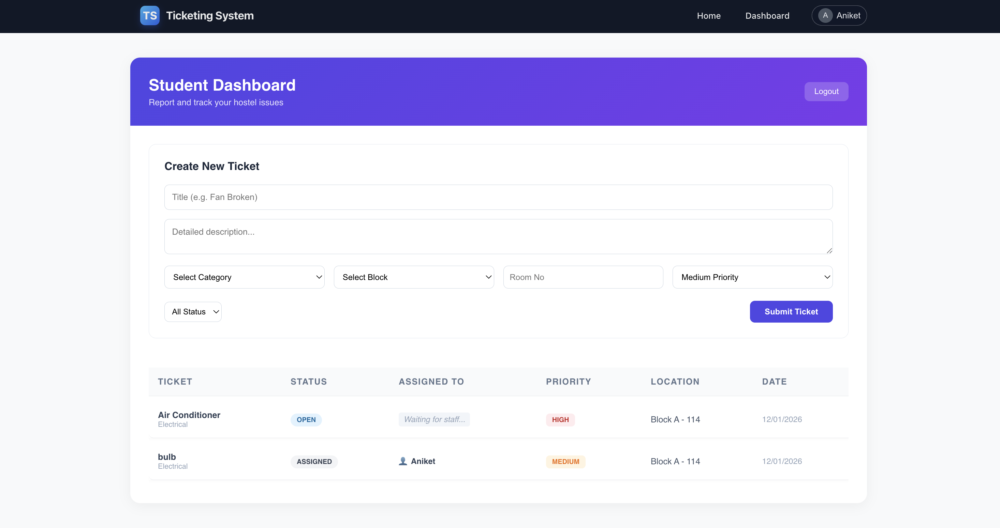
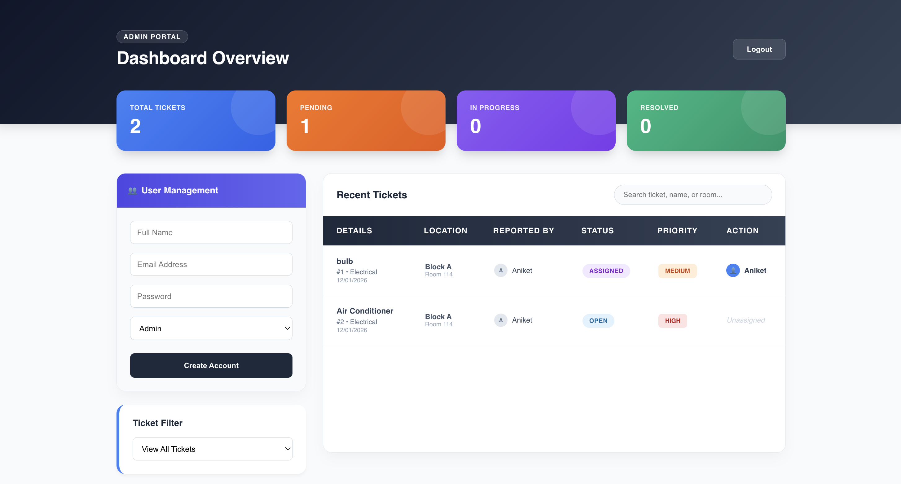
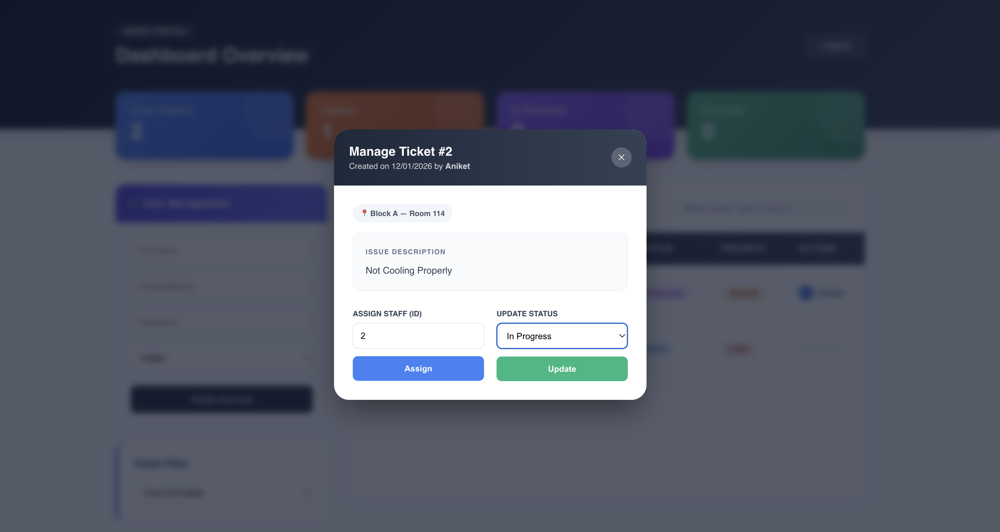
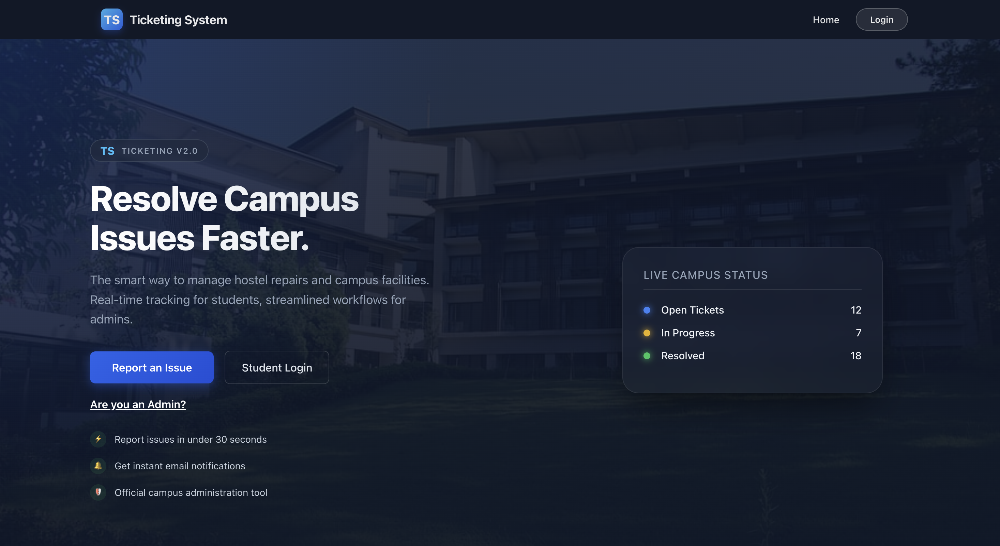

# 🎫 Hostel Issue Tracker

A full-stack hostel maintenance management system. Students can report infrastructure issues, and administrators can track, manage, and resolve tickets through a centralized dashboard.

## 🚀 Live Demo
- **Frontend:** [https://issue-tracker-frontend-two.vercel.app/](https://issue-tracker-frontend-two.vercel.app/)
- **Backend:** [https://issue-tracker-backend-1-86vi.onrender.com](https://issue-tracker-backend-1-86vi.onrender.com)

---

## 📸 Project Showcase

| 📊 Student Overview | 🔐 Admin Control Center |
| :---: | :---: |
|  |  |
| *Student view for tracking raised issues* | *Administrative overview of all requests* |

| 🎫 Ticket Management | 📈 Analytics Dashboard |
| :---: | :---: |
|  |  |
| *Assigning and resolving student tickets* | *Real-time status updates and metrics* |

---

## ✨ Key Features
- **Role-Based Access:** Distinct interfaces for Students and Administrators.
- **JWT Authentication:** Secure session management and resource protection.
- **Ticket Lifecycle:** Full CRUD operations for reporting and resolving hostel issues.
- **Real-time Status:** Instant updates on ticket progress (Open, In Progress, Resolved).
- **Cross-Platform Deployment:** Seamless integration between Vercel and Render.

## 🛠️ Tech Stack
- **Frontend:** React.js, Vite, React Router.
- **Backend:** Java Spring Boot, Spring Security, Hibernate/JPA.
- **Database:** PostgreSQL.
- **Tools:** Git, GitHub Actions, Vercel, Render.

---

## 🛠️ Technical Challenges & Solutions

### 🔌 Environment Synchronization
**Challenge:** Managing API endpoints across local and production environments without manual code changes.
**Solution:** Implemented a centralized `apiFetch` utility using `import.meta.env`, allowing the application to scale dynamically based on the deployment target.

### 🛡️ Security & CORS
**Challenge:** Enabling secure cross-origin communication between Vercel and Render.
**Solution:** Developed a specialized `CorsFilter` in Spring Boot to authorize production domains and handle pre-flight requests for JWT-protected endpoints.

---

## ⚙️ Local Setup

1. **Clone:** `git clone https://github.com/yourusername/issue-tracker.git`
2. **Frontend Config:** Create `.env.local` with `VITE_API_BASE_URL=http://localhost:8080`
3. **Run:** `npm install && npm run dev`